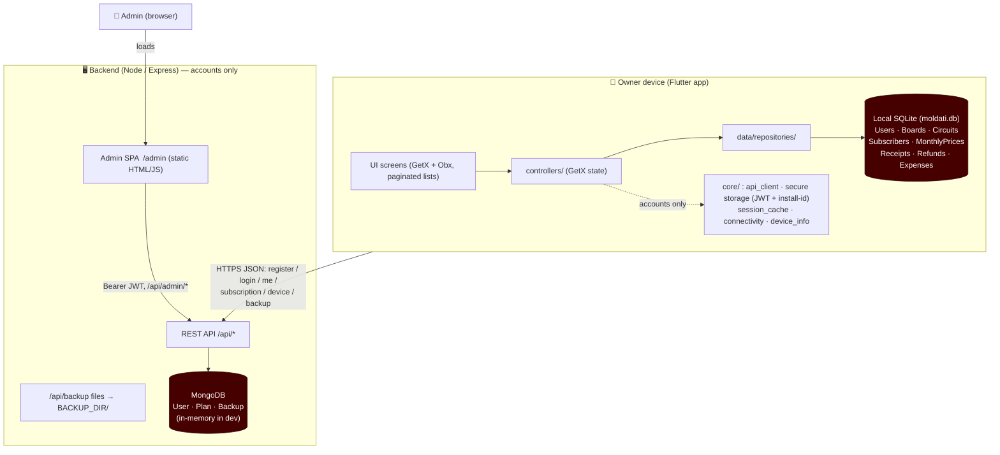
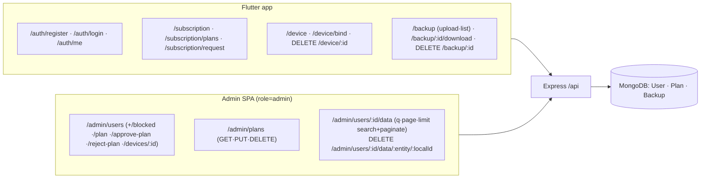

# System Structure

A map of the whole system for **Moldati Owner** (generator-management): the
Flutter **frontend**, the Node **backend**, the **databases**, the **API**, and
the **admin panel** — plus how they connect and who owns which data.

> Architecture applied per the original STRUCTURE.md pattern, adapted to this
> project's domain (generator subscribers / boards / circuits / billing). The
> business idea and flow are unchanged; only the accounts/online layer was added.

---

## 1. High-level architecture



**The boundary that defines the system:** the device-local SQLite database is
the **source of truth** for all **generator business data** (boards, circuits,
subscribers, monthly prices, receipts, refunds, expenses) — the app reads and
writes it and works **fully offline**. Those changes are now also **synced
(pushed) to a server mirror** (`/api/sync`) so the **admin panel can view each
owner's data**; the mirror is a read-only copy for admins, never the app's
source of truth. Local staff users stay device-only. The backend owns
authentication, subscription/plan, device binding, opaque **cloud DB backups**,
and the **sync mirror** — backed by MongoDB.

**Offline-first:** the network is needed only for register / sign-in,
subscription checks (when online), cloud backup, and **pushing pending changes
to the mirror**. Everything else works offline; the account is cached locally
after first sign-in and only a `401/403` from `/auth/me` ends the session.

---

## 2. Repository layout

```
generatormanagment/                 ← git repo root (Flutter project)
├── lib/                            ← FRONTEND (Dart / Flutter, GetX)
├── backend/                        ← BACKEND (Node / Express / Mongoose)
├── android/ ios/ web/ …            ← Flutter platform shells
├── test/                           ← Flutter tests
├── CLAUDE.md                       ← agent guidance
├── STRUCTURE.md                    ← this file
└── pubspec.yaml                    ← Flutter deps
```

### 2a. Frontend — `lib/`

```
lib/
├── main.dart                       ← GetMaterialApp + AppBinding + routes
├── core/                           ← accounts/online infrastructure
│   ├── api_config.dart             ← API_BASE_URL (--dart-define) + endpoints
│   ├── api_client.dart             ← REST client → ApiException (+ multipart/download)
│   ├── secure_store.dart           ← JWT + persistent install-id (encrypted)
│   ├── session_cache.dart          ← offline-first account cache (SharedPreferences)
│   ├── connectivity_service.dart   ← online/offline gate
│   ├── device_info_service.dart    ← device fingerprint (+ native IMEI/MAC channel)
│   ├── logger.dart
│   └── app_binding.dart            ← central DI (replaces per-screen Get.put)
├── controllers/                    ← one GetxController per feature
│   ├── auth_controller.dart        ├── subscription_controller.dart
│   ├── core_controller.dart        ├── dashboard_controller.dart
│   ├── billing_controller.dart     ├── expense_controller.dart
│   ├── settings_controller.dart    └── main_nav_controller.dart
├── data/
│   ├── db_helper.dart              ← single sqflite connection + schema
│   ├── repositories/               ← ONLY layer that touches the DB / backend
│   │   ├── core_repositories.dart       billing_repositories.dart
│   │   ├── expense_repository.dart      user_repository.dart
│   │   ├── auth_repository.dart    ┐
│   │   ├── subscription_repository.dart├ talk to the backend, not the DB
│   │   ├── device_repository.dart  │
│   │   └── backup_repository.dart  ┘
│   └── models/
│       ├── core_models.dart  billing_models.dart  expense_model.dart  user_model.dart  (local)
│       ├── account.dart (Account · Subscription · DeviceBinding · BackupEntry)  plan.dart  (remote)
├── views/
│   ├── root_handler.dart           ← gate: Login / PlanSelection / Main
│   ├── auth/signup_screen.dart
│   └── screens/*.dart              ← list screens are GetX + paginated
└── utils/  translations.dart (ar/en)  pdf_service.dart  bluetooth_print_service.dart
```

**Layering rule (GetX):**

```
UI screen (Obx) → controllers/ (Rx state) → data/repositories/ → db_helper (SQLite)
                                           └→ auth/subscription/device/backup_repository → core/api_client → backend
```

Screens never touch the DB or backend directly and resolve controllers via
`Get.find` (registered once in `AppBinding`). Every scrollable list paginates
via the canonical pattern (fetch `limit + 1` to detect the next page; `loadMore`
on scroll near bottom; reset to page 1 on filter change).

### 2b. Backend — `backend/`

```
backend/
├── src/
│   ├── server.js                   ← Express app; mounts routes, serves /admin
│   ├── config/{env,db}.js          ← env + Mongo / in-memory connection
│   ├── bootstrap/seed.js           ← default plans + bootstrap admin
│   ├── scripts/seedPlans.js        ← npm run seed
│   ├── models/{User,Plan,Backup}.js
│   ├── middleware/{auth,validate,error}.js
│   ├── controllers/{auth,subscription,device,backup,admin}Controller.js
│   ├── routes/{auth,subscription,device,backup,admin}.js
│   └── utils/{token,asyncHandler,serialize,devices}.js
├── public/admin/index.html         ← ADMIN PANEL (single-file hash-routed SPA)
├── API_CONTRACT.md                 ← endpoint source of truth
├── .env.example                    ← config (.env git-ignored)
└── package.json                    ← start / dev / seed
```

Run: `cd backend && npm install && npm run dev` (defaults to `http://localhost:4000`,
in-memory Mongo). Point the app at it with
`flutter run --dart-define=API_BASE_URL=http://10.0.2.2:4000` (emulator) or the
LAN IP for a physical device.

---

## 3. The API surface (`/api`, JSON, Bearer JWT)



Full request/response detail: [backend/API_CONTRACT.md](backend/API_CONTRACT.md).

---

## 4. Data ownership

| Data | Where it lives | Reachable by |
|---|---|---|
| Boards, circuits, subscribers, monthly prices, receipts, refunds, expenses | **Device SQLite** (`moldati.db`) — source of truth | the app + a **synced mirror** in MongoDB the admin panel reads |
| Local staff users | **Device SQLite** (`moldati.db`) | the app only |
| JWT + install-id | Device **secure storage** | the app only |
| Cached account + subscription | Device **SharedPreferences** (`session_cache`) | the app only |
| Accounts, roles, subscription, bound devices | **MongoDB** (backend) | app (own account) + admin panel |
| Plans | **MongoDB** | app (active list) + admin (full CRUD) |
| Synced business data (per-account mirror) | **MongoDB** (backend, via `/api/sync`) | the owning account + admin (read-only view — search + server-side pagination; **delete** is the only admin write) |
| Cloud DB backups (opaque `.db` snapshots) | **Backend disk** (`BACKUP_DIR/<userId>`) | the owning account + admin |

---

## 5. Key runtime flows

```mermaid
sequenceDiagram
  participant U as User
  participant App as Flutter app
  participant API as Backend /api
  participant SQL as Local SQLite

  Note over App: Startup (offline-first)
  App->>App: bootstrap() restore cached account
  App-->>API: GET /auth/me (only if online)
  API-->>App: account / 401·403 (only this ends session)

  Note over App,API: Register (online) sends device fingerprint
  U->>App: Sign up
  App-->>API: POST /auth/register {..., device:{installId,deviceId,model,imei?,mac?}}
  API-->>App: { token, account } (device bound; maxDevices enforced)

  Note over App: No active plan → PlanSelection gate
  App-->>API: POST /subscription/request {planCode}
  API-->>API: status = pending (awaits admin approval)

  U->>App: Daily use (offline)
  App->>SQL: read/write boards, subscribers, receipts, expenses

  U->>App: Settings → Back up now
  App-->>API: POST /api/backup (multipart moldati.db)
```

The admin panel ([backend/public/admin/index.html](backend/public/admin/index.html))
is a hash-routed SPA with a screen per entity/action (Dashboard, Users,
User-detail, Plans) driving the `/api/admin/*` endpoints with a Bearer JWT.

---

## 6. Sync (device → server mirror)

The app stays offline-first, but local business changes are now **pushed** to a
per-account server mirror so admins can view each owner's data. The flow is
**push-only** — the device SQLite is the source of truth and is never written by
sync:

```
SQLite triggers → sync_outbox table → SyncService (drains, builds records)
   → SyncRepository → POST /api/sync/push → per-account mirror in MongoDB
                                          → admin reads via /api/admin/users/:id/data
```

- **Capture:** SQLite triggers record every insert/update/delete to a local
  `sync_outbox` table (entity + local_id + op). Sync never modifies the device
  rows, so triggers don't recurse.
- **Drain & push:** `lib/core/sync_service.dart` collapses the outbox to the
  latest op per row, reads the current SQLite row as `data`, and POSTs batches to
  `/api/sync/push`; drained entries are cleared only after the push succeeds.
- **Orchestration:** `lib/controllers/sync_controller.dart` auto-syncs on
  connectivity regained and on a periodic tick (online-gated). A small backlog
  uploads silently; above the large threshold it **asks before uploading**.
- **Entities synced:** `subscribers, boards, circuits, monthly_prices, receipts,
  refunds, expenses` (local staff users are not synced). Each record is
  `{ entity, localId, deleted, updatedAt, data }`.
- **Restore path:** `GET /api/sync/pull?since=ISO` lets a new device pull the
  mirror back; day-to-day operation is push-only.
- **Admin view:** the admin SPA's per-entity screens read the mirror via
  `GET /api/admin/users/:id/data?entity=&q=&page=&limit=` (case-insensitive
  search over per-entity fields, applied before server-side pagination; returns
  `{ records, total, page, limit }`). The mirror stays push-only otherwise — the
  only admin write is `DELETE /api/admin/users/:id/data/:entity/:localId`, which
  hard-deletes a single mirrored record.
